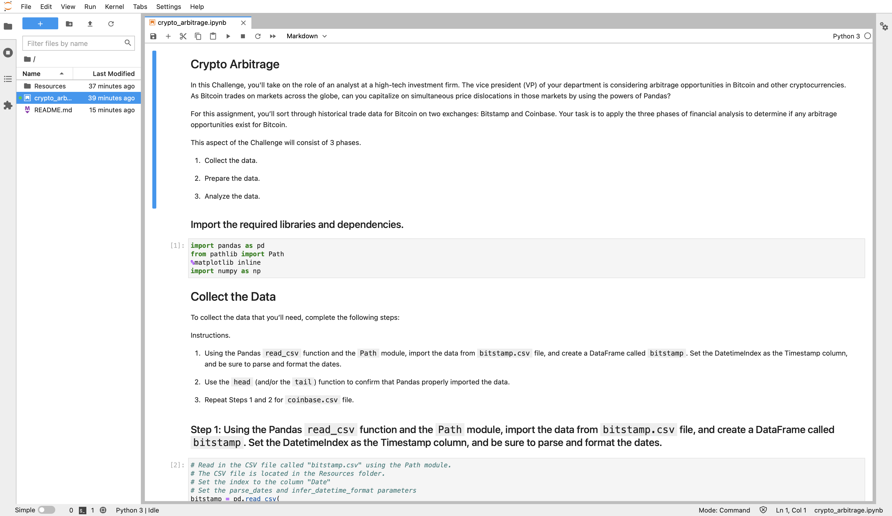

#Arbitrage Profit Analysis BitStamp V. Coinbase

---

This is a Jupyter Lab via command line interface created code used with the assitance of Pandas to create an analysis of two DataSets (bitstamp.csv) and (coinbase.csv) to determine which time frame presented the best opportunity for arbitrage between the two exchanges trading Bitcoin. Within this analysis I remove the unwanted and empty rows to conduct an analysis between the two exchanges closing prices over the course of 3 months from January 2018-March 2018. I then attempt to select 3 days out of the time frame to determine which time presented the most profitable arbitrage trades and whether or not the opportunities continued throughout the whole three month period. With the Help of Jupyter Lab and Pandas I was able to create detailed plot based analysis of the two exchanges and even which day presented the most profit by buying from one and selling on the other exchange, all was conducted to the best of my knowledge.
---

## Technologies

This project uses python 3.7 with the following packages:

* [Pandas](https://github.com/pandas-dev/pandas) - For the command line interface, help page, and entrypoint

* [Jupyter Lab](https://github.com/jupyterlab/jupyterlab-git) - For interactive user prompts, dialogs and analysis


 
---

## Installation Guide

Before running the application first install the following dependencies.


* [Install] Anaconda with Python 3.7+(https://docs.anaconda.com/anaconda/install/)
You should always be in a conda dev environment when launching JupyterLab.
 


---

## Usage

To view the crypto_arbitrage.ipynb, open Terminal/ Use CLI

```conda activate dev
cd <location of (crypto_arbitrage.ipynb)>
jupyter lab
```

Upon launching the Jupyter Lab application you will be greeted with the following prompts.


---

## Contributors

Brought to you by MartyCodes333(martique.henton@gmail.com) with the help of 2021 UW FinTech Bootcamp Instructors, TA's and Fellow Classmates


---